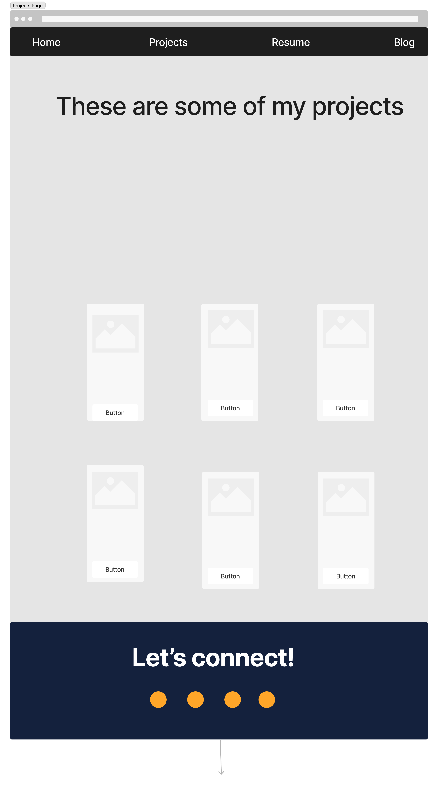
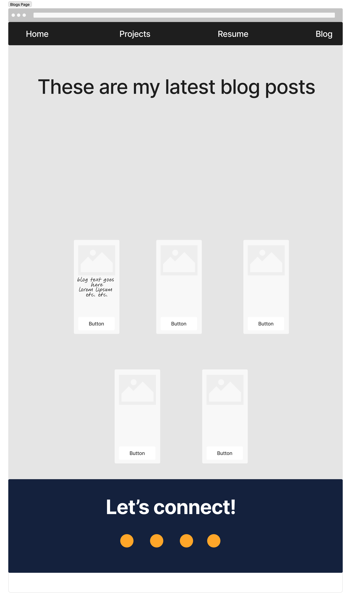
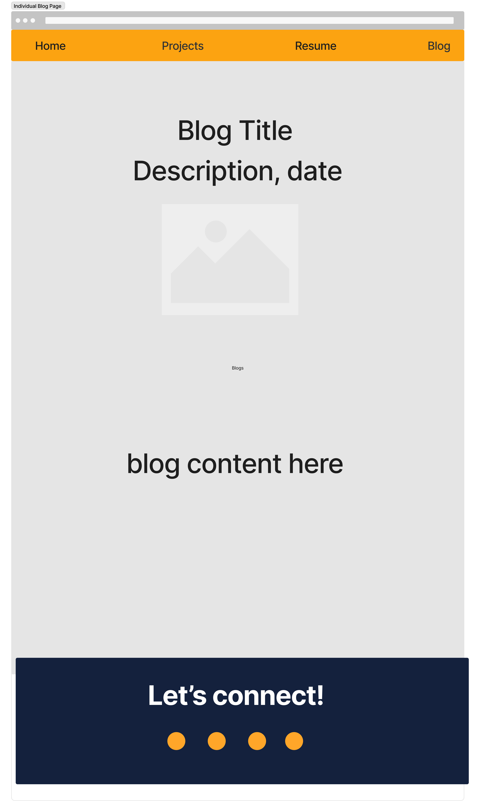

# T1A2-Portfolio

Personal Portfolio for Coder Academy Assignment and my own growth as a web developer. [link to Github repo](https://github.com/Reyleth/T1A2-Portfolio)

All material learnt throughtout weeks 1 and 2 of Coder Academy have been applied to demonstrate my ability.

## Purpose

The purpose of this portfolio is to represent myself as a aspiring software developer in a professional manner. The layout has been designed with simplicity and professionalism in mind.

## Target Audience

The target audience of this project is to prospective employers and anyone who is looking for a like minded individual to collaborate with. I created the sitemap and wireframe with this in mind and designed the portfolio in a way to be visually pleasing to anyone looking to employ or collaborate with me.

## Tech Stack

The entire portfolio is made with only Vanilla HTML5 and CSS.

## Design & Planning

The wireframe and sitemap for this project was created on figma [click here to view figma page](https://www.figma.com/file/rZXdfGsApolNkm1b2iYUX0/Portfolio-Wireframe?type=whiteboard&node-id=0%3A1&t=HzAj9ajFPSizoi3d-1) a local copy of the sitemap is also linked in the docs subdirectory. (Canvas submission only)

### Sitemap

The sitemap flow is very simple and designed for ease of access. All pages link together making all information easily accessible. A navbar will be implemented to be the link between the four main pages. With individual blog posts being linked to in the main blogs page.

## Wireframe

As linked above, figma was used to design the wireframes of the website. This is my first time using figma and I was able to learn alot about the tool over the course of drawing up my wireframe.

I decided to keep a consistant style across all pages of my portfolio. The colour palette was chosen to meet the purpose of the portfolio as a professional representation of myself. Black, dark blue, white and grey to demonstate simplicity and professionalism with orange sprinkled in as it is my favourite colour.

### Home Page

The basis of the website revolves around the basic layout of the home page. Each page would include a nav bar and contacts section at the bottom. The main content would be divided by background colour changes as the viewer scrolled.

Unique to the home page would be the about me section and the skills section. I gave myself a rough overview of how I wanted these sections to look in conjunction with eachother. In the mobile version I wanted the logos in the skills section to be become a flex column.

### Projects Page

In my original design for the projects page I wanted to create "windows" to other projects I have completed as an aspiring developer. I would use the CSS Flex layout to position them into a main projects section that would be the content of the page. As for this page and all following pages the navbar and contacts section would be reused to complete the page.

### Resume Page

The resume page is designed so that a preview of the resume would display on the right and then the download link on the left. Underneath would be a brief work experience section. Overall I choose this design as it simple and acheived the professional look I was aiming for.

### Blogs Page

The blogs page was designed to use similar tiles to the projects section but instead to link to seperate individual blog pages. They would contain images related to the post and a simple title and date. On a mobile viewport the tiles would collapse into a single column

### Individual Blog Page

The individual pages were designed to be simple to read on all viewports. A simple heading, followed by a sub-heading, image then content. Simple but impactful design.

## Website Overview & Features

This document was designied with 3 main viewport width breakpoints in mind. Mobile, Tablet and Desktop. Each viewport type has some unique styling to accomodate. This portfolio contains four main pages and five blogs.

### Home

<!-- hero image here -->

The home page is used as an overview displaying a large "hero section" as soon as it is loaded that jumps to the chase and introduces myself with an image, my name and who I am. I designed this to be simple yet bold and stand out to viewers entering the page. On mobile devices the 

<!-- about me image here -->

Following the hero section the about me section that serves as a more thorough introduction to myself and what drives me. 

<!-- skills image here -->

This is followed by a skills section that shows the coding languages I am knowledgable in and brief paragraphs on my hard and soft skills. An API to my Github graph is used to interest viewers and also give attention to the document. I also added in my linkedin banner for further representation of myself.

### Projects

<!-- projects image here -->

The projects page shows an overview of my completed projects thus far. The main feature of this page are the "link tiles" that each contain links to real Github pages on my Github account. The CSS grid layout is used to space out the tiles and a hover effect is used on the text for character and to stand out. The "Show All" button directs the viewer to my full list of Github repos on Github but may include a seperate html page for this purpose in future updates.

### Resume

<!-- resume image here -->

The resume page is used as a way for the viewer to access my up to date resume. I intended for the design to be quite simplistic with the preview image of the document displayed on the left side with the link on the right.

### Blogs

<!-- blogs image here -->

The blog page also makes use of the "link tiles" I made and reuses the styling from the projects portion. Similarly to the projects page a CSS grid layout is used to show each blog post simply with a title and date posted. Each of these blog links connect to a deeper html file that displays the full blog with an image in each for viewer engagement. Currently this is all done through static webpages however in a future update I would like to add Javascript to make the blogs dynamic and gain the ability to add new blogs to the page.

### Individual Blog Posts

<!-- image here -->

text goes here.

### Contacts

<!-- contacts image here -->

Last but not least is the contacts section that is located on the bottom of every html page. The function of this part of the document is for any viewer that reachs the bottom of the page. It contains further links to my social media accounts such as Github, linkedin, Discord and my Email. The design accounts for all screen sizes by using a flex layout and has a transform hover effect for a nice touch.

## Future Updates